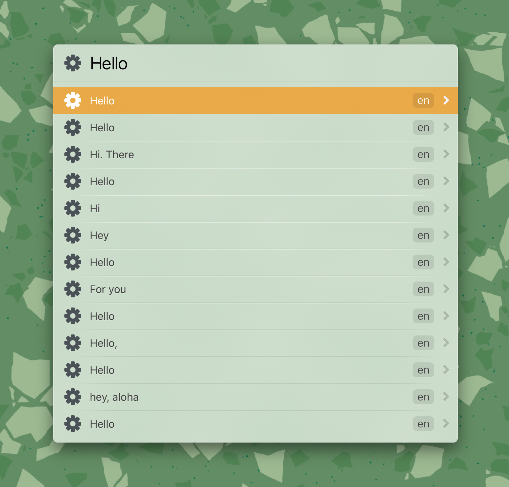

# LaunchBarAction-i18ns.com

A launch bar action for [App & Web I18n Translation Search](https://i18ns.com)

## Usage

Type `i18n` to trigger the action.

### @token

Use command `@token XXXXXX` to set API Key. You can get an API key from https://i18ns.com.

### @fromLang

Use command `@fromLang zh` to set the language you use. 

### @targetLang

Use command `@targetLang en` to set the primary language you want the keyword to be translated into. 

Don't worry, all translations in different languages will still return when it's set, just enter into each suggested translation to see all other languages.

### Translate keyword

Just type in your keyword and hit enter. The service seems to be slow, be patient.
